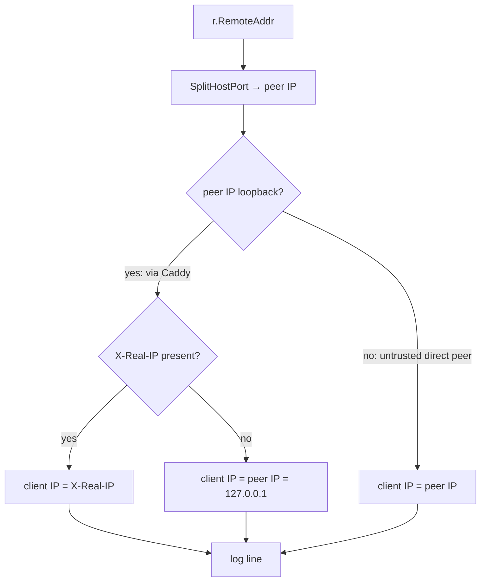

## Context

See `proposal.md` — Why. `aged` is a ~307-LOC single-package Go HTTP secret server. Auth is enforced by `bearerMiddleware` in `cmd/aged/server.go`, which today rejects bad tokens silently — no log line, nothing for an intrusion-detection tool to match. The process runs as a systemd unit, so stdout/stderr land in journald.

Constraints that shape the approach:

- **Deployment shape is fixed.** `aged` listens on `127.0.0.1:8743`, always behind Caddy. Caddy is the only expected upstream peer, so on any real request `r.RemoteAddr` is a loopback address. The real client IP must come from a header Caddy sets.
- **No new dependencies.** stdlib `log` + `net/http` only; the module is `go 1.22`.
- **The log line is a machine interface.** fail2ban parses it with a regex. Its format is a compatibility contract, not cosmetic text.
- **Blast radius is one function.** `bearerMiddleware` is the only logic that changes, plus its `serve()` call site and the `testServer` test helper.

## Goals / Non-Goals

**Goals:**

- Emit exactly one log line per authenticated request recording the outcome and the resolved client IP.
- Resolve the client IP safely — never trust proxy headers from an untrusted peer.
- Make the log line a stable, exact-match target for a fail2ban `failregex`.
- Keep the log output injectable so tests assert on it without mutating global logger state.

**Non-Goals (design-level boundaries):**

- No structured/JSON logging, no severity levels, no log-level configuration. One flat line, one format.
- No rate limiting, throttling, or in-process IP blocking — that is fail2ban's job, driven by the journal.
- No `X-Forwarded-For` support (see Decision 2). No general multi-hop proxy trust model.
- No change to the auth mechanism itself (constant-time compare stays as-is) or to any other handler.

## Decisions

### 1. Inject the log destination as `io.Writer`, not the package logger

`bearerMiddleware(token string)` becomes `bearerMiddleware(token string, w io.Writer)`. Inside the closure, construct one logger: `log.New(w, "", 0)` (prefix empty, flags `0`).

- **Why an `io.Writer` parameter:** it lets `serve()` pass `os.Stderr` in production while tests pass a `*bytes.Buffer` and assert on the captured bytes — no mutation of the global `log` state, no test-ordering coupling. The `testServer` helper in `server_test.go` is updated to accept a writer (or hold a buffer) accordingly.
- **Why `flags = 0`:** journald stamps every entry with its own receive timestamp. A stdlib `LstdFlags` prefix would put a *second*, redundant, slightly-skewed timestamp inside the message. Flags `0` makes journald the sole timestamp authority.
- **Alternative rejected:** keep using package-level `log.Printf`. Rejected because it is unwriteable-to in tests without global mutation, and gives no injection seam.

### 2. IP resolution: trusted-proxy model, single header, no `X-Forwarded-For`

This is a **security constraint, non-negotiable** — pinned here so the spec and tests can pin it too. Algorithm, in order:

1. Split the port off `r.RemoteAddr` (`net.SplitHostPort`) to get the **peer IP**.
2. If the peer IP is loopback (`127.0.0.1` or `::1`): the request came through Caddy, so read `X-Real-IP` as the client IP. If `X-Real-IP` is absent, fall back to the peer IP itself (`127.0.0.1`).
3. If the peer IP is **not** loopback: use the peer IP directly and **never** read any proxy header — a direct, non-local peer is untrusted and could spoof headers.

- **Why a single header (`X-Real-IP`) and not `X-Forwarded-For`:** `X-Forwarded-For` is a comma-delimited list whose leftmost entry is attacker-controlled and whose correct parse depends on knowing the trusted-hop count. `X-Real-IP` carries exactly one value that Caddy sets from the real connection (`{remote_host}`). One value, one trusted setter, no list-parsing ambiguity, minimal spoofable surface. The earlier `proposal.md` still describes an `X-Real-IP → X-Forwarded-For → RemoteAddr` chain — that is superseded by this decision (see Risks).
- **Why the loopback gate at all:** without it, an attacker who reaches `aged` directly (misconfiguration, or a future non-loopback bind) could forge `X-Real-IP` and poison fail2ban into banning arbitrary third-party IPs. The gate means header trust is granted only to a loopback peer, i.e. Caddy on the same host.
- **Why the `127.0.0.1` fallback is safe:** when Caddy is misconfigured and omits the header, the logged IP is loopback, which fail2ban's default `ignoreip 127.0.0.1/8` never bans. Fail-safe, not fail-open.

### 3. Path sanitisation before interpolation

Before the method and URL path are written into the log line, strip/replace CR (`\r`), LF (`\n`), and other ASCII control characters (`< 0x20`, plus `0x7f`).

- **Why:** the method and path are attacker-controlled request data. An unsanitised `\r\n` in the path lets an attacker forge additional log lines (CRLF log injection) — e.g. inject a fake `auth failure: ... from <victim-IP>` to make fail2ban ban an innocent address. Sanitising the two untrusted fields closes that. The resolved IP is derived, not raw request text, so the poisoning vector is the method/path.
- **Approach:** a small local helper that maps disallowed runes to a safe placeholder (e.g. `_`). Kept minimal — this is a sanitiser, not a general encoder.

### 4. Pinned log-line format (fail2ban interface contract)

Both lines are written through the same logger at the same level (stdlib `log`, no severity prefix):

- Failure: `auth failure: <METHOD> <PATH> from <IP>`
- Success: `auth ok:  <METHOD> <PATH> from <IP>`

`<METHOD>` and `<PATH>` are sanitised (Decision 3); `<IP>` is resolved (Decision 2). This exact shape is what the fail2ban `failregex` matches — treat it as frozen. Any future change to it is a breaking change to the fail2ban filter and must be made in lockstep.

> Note for the spec author: the failure and success lines are the pinned behavioural obligations of the modified **HTTP Authentication** requirement. Transcribe both formats verbatim into the delta spec.

### 5. `log.SetFlags(0)` in `serve()`

Call `log.SetFlags(0)` in `serve()` before the listener starts, and pass `os.Stderr` into `bearerMiddleware`.

- **Why:** the rest of the file logs via package-level `log.Printf`/`log.Println`. Setting the global flags to `0` at startup makes *all* of `aged`'s output flag-free and consistent with the middleware logger, so journald owns every timestamp uniformly. It also aligns the injected middleware logger (flags `0`) with the global one.

### 6. fail2ban integration via the systemd journal

Ship reference configs under `contrib/fail2ban/` (deployment artifacts, not code — no spec capability):

- `filter.d/aged-auth.conf` — `failregex` matching `auth failure: \S+ \S+ from <HOST>`.
- `jail.d/aged.conf` — `backend = systemd`, `journalmatch = _SYSTEMD_UNIT=aged.service`, `maxretry = 5`, `findtime = 60`, `bantime = 600`.

- **Why the systemd backend and `journalmatch` (not a log file):** `aged` writes to stdout/stderr → journald; there is no log file to tail. The systemd backend reads the journal directly and `journalmatch` scopes fail2ban to `aged.service` entries only, so it never matches on unrelated units. This is why Decision 1's flags-`0` choice matters — it keeps the journal message clean for the regex.

## Risks / Trade-offs

- **Success logging discloses secret-access metadata** → The `auth ok:` line records which path (i.e. which secret name) was fetched and by whom. The user explicitly requested success logging; the trade-off is that anyone with journal read access sees an access pattern over secret names. **Mitigation:** document the disclosure in both the README and the spec so operators make an informed choice; journal access is already privileged.
- **`proposal.md` describes a superseded IP chain** → It still lists `X-Real-IP → X-Forwarded-For → RemoteAddr`. Decision 2 overrides it. **Mitigation:** the engineer should reconcile the proposal's "What Changes" wording (drop the `X-Forwarded-For` hop, add the loopback-trust gate) when authoring the spec, so proposal, spec, and design agree.
- **Caddy misconfiguration logs loopback instead of the real IP** → If the operator omits `header_up X-Real-IP`, every failure logs `from 127.0.0.1` and fail2ban bans nothing (ignored by `ignoreip`). **Mitigation:** fail-safe by design; README makes the Caddyfile directive a required install step.
- **journald rate-limiting can drop lines under a token brute-force flood** → journald's default `RateLimitBurst`/`RateLimitIntervalSec` may discard messages exactly when an attack generates many failures, blinding fail2ban. **Mitigation:** README includes a journald rate-limit tuning note for the `aged.service` unit.
- **Direct non-loopback exposure is out of the trust model** → If `aged` is ever bound to a non-loopback interface, Decision 2 falls back to the peer IP (correct) but loses X-Real-IP resolution. That is intended: the design trusts headers only from a loopback Caddy. Rebinding `aged` publicly is a deployment change outside this scope.

## Migration Plan

No data or API migration. Deploy is a normal binary replacement plus operator config:

1. Ship the new binary (modified `bearerMiddleware`, `serve()` call site).
2. Operator adds `header_up X-Real-IP {remote_host}` inside the Caddy `reverse_proxy` block and reloads Caddy.
3. Operator copies `contrib/fail2ban/filter.d/aged-auth.conf` and `jail.d/aged.conf` into `/etc/fail2ban/`, then reloads fail2ban.
4. (Optional) Operator applies the journald rate-limit tuning note.

**Rollback:** revert the binary. The fail2ban and Caddy config additions are inert without matching log lines and can be left in place or removed independently.

## Component / Work Breakdown

- **`bearerMiddleware` signature + body** (application code, Go) — add `io.Writer` param, build `log.New(w,"",0)`, resolve IP per Decision 2, sanitise per Decision 3, emit the two pinned lines. *Done when:* both formats emit exactly as pinned and the loopback/non-loopback/absent-header branches each produce the correct IP.
- **`serve()` call site** (application code, Go) — `log.SetFlags(0)`; pass `os.Stderr` into `bearerMiddleware`. *Done when:* production output is flag-free and the middleware receives stderr.
- **Path sanitiser helper** (application code, Go) — map CR/LF/control runes to a placeholder. *Done when:* a path containing `\r\n` cannot introduce a second log line.
- **`testServer` helper update** (test code, Go) — accept an `io.Writer`/hold a `bytes.Buffer` so tests assert log output without touching package-level `log`. *Done when:* tests read captured bytes for both success and failure and for the IP-resolution branches.
- **`contrib/fail2ban/filter.d/aged-auth.conf` + `jail.d/aged.conf`** (reference config) — as specified in Decision 6. *Done when:* the `failregex` matches a real `auth failure:` journal line and the jail scopes to `aged.service`.
- **README deployment section** (documentation) — Caddyfile `header_up X-Real-IP {remote_host}`, fail2ban install steps, journald rate-limit tuning note, and the success-logging metadata-disclosure trade-off. *Done when:* an operator can wire Caddy + fail2ban from the README alone and understands the disclosure.

## Open Questions

None blocking. The `proposal.md` IP-chain wording (noted under Risks) is a reconciliation the engineer performs while authoring the spec, not an unresolved design question.
