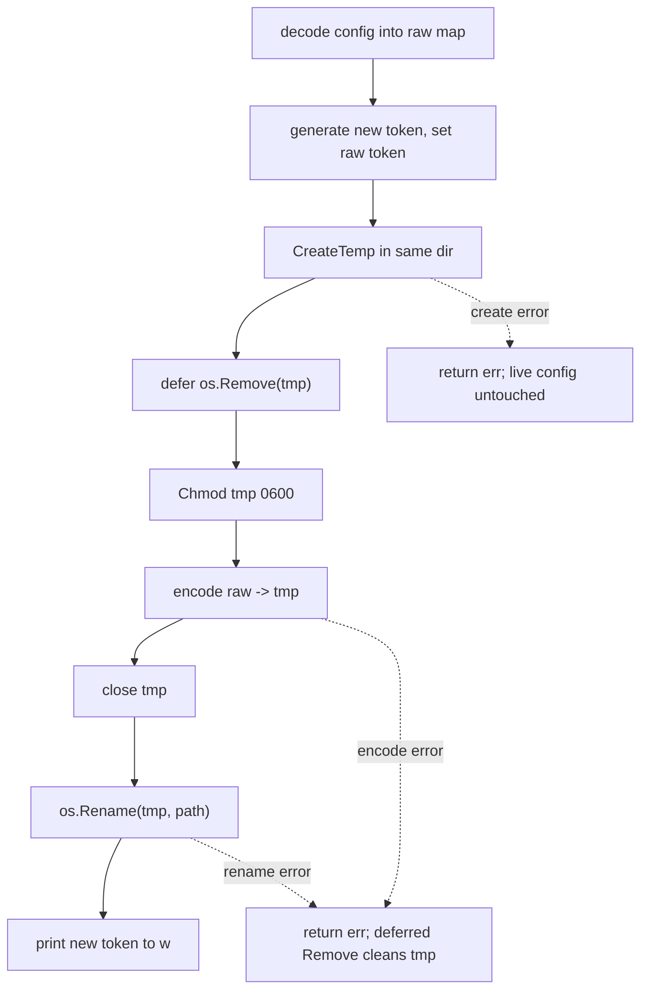

## Context

See `proposal.md` — Why. A formal security review of aged's authentication path produced nine findings; six are actionable in Go code and covered here. aged is a single-`main`-package HTTP secret server (`cmd/aged/`) fronted by Caddy on `127.0.0.1:8743`, consumed by chezmoi via `aged get` over stdout. Every fix in this change is surgical: no new dependencies, no new endpoints, no change to the request/response contract, and no change to the fail2ban log-line format (fail2ban matches the `unauthorized`/`auth failure` message body, not headers or status wording).

Constraints that shape the approach:

- **No new Go dependencies.** All fixes use the standard library plus the already-imported `github.com/BurntSushi/toml`.
- **stdout is a contract.** The client subcommands emit only the secret value on stdout; any new diagnostic output must go to stderr so chezmoi integration stays byte-clean.
- **Loopback-only reachability.** The listener binds `127.0.0.1:8743`, so the only reachable non-forged peer is the local reverse proxy. This bounds the real-world blast radius of the network-facing fixes (L-01, L-02, I-03) even though each is written to be correct in the general case.

Affected files (existing, all in `cmd/aged/`): `rotate.go`, `config.go`, `server.go`, `server_test.go`. No files are created or deleted.

## Goals / Non-Goals

**Goals:**

- Close the config-corruption window in `rotateToken` with a POSIX-atomic write.
- Surface config parse failures as operator-visible diagnostics without breaking stdout contracts.
- Make loopback trust detection correct across the forms Go can produce for a loopback peer.
- Bound per-connection resource consumption on the HTTP server.
- Satisfy RFC 7235 §3.1 by emitting `WWW-Authenticate` on 401.
- Align the test helper's name validation with production so tests exercise the real gate.

**Non-Goals (design-level boundaries beyond the proposal's scope):**

- **fsync durability for M-01.** The audit finding is the *truncate window*, which `os.Rename` closes fully. Guaranteeing the bytes survive a power loss *after* a successful rename (an `f.Sync()` before rename, and/or a directory fsync) is a distinct durability concern, deliberately excluded.
- **X-Forwarded-For parsing (L-01).** Trust remains anchored to `X-Real-IP` set by Caddy; XFF is not consulted. L-01 fixes only *how the peer is classified as loopback*, not *which header is trusted*.
- **Graceful shutdown / connection draining.** L-02 adds timeouts to the existing blocking `ListenAndServe`; it does not introduce `Shutdown`, signal handling, or a context lifecycle.
- **L-03 (systemd hardening) and I-01/I-02** remain out of scope per the proposal.

## Decisions

Each fix is an independent, self-contained edit. They share no state and can be implemented and reviewed in any order.

### M-01 — Atomic `rotateToken` write (`rotate.go`)

**Decision.** Replace the in-place `os.OpenFile(path, O_WRONLY|O_TRUNC, 0o600)` + encode with a stage-and-rename sequence:

1. `tmp, _ := os.CreateTemp(filepath.Dir(path), ".config-*.toml")` — temp file in the **same directory** as the target, guaranteeing the same filesystem so the later `os.Rename` is atomic (a cross-filesystem rename is a copy, which is not atomic).
2. `defer os.Remove(tmp.Name())` **immediately** after `CreateTemp` succeeds — cleans up the stray temp file on every failure path (encode error, close error, or a panicking encoder). After a successful rename the deferred remove is a harmless no-op because the inode no longer exists at the temp name.
3. `os.Chmod(tmp.Name(), 0o600)` before writing — `CreateTemp` creates `0o600` on most platforms but does not guarantee it; the explicit chmod pins the mode.
4. Encode the preserved raw map to the temp file, then close it.
5. `os.Rename(tmp.Name(), path)` — the atomic swap. A reader either sees the complete old file or the complete new file, never a truncated one.

**Rationale.** stage-and-rename is the standard POSIX atomic-replace idiom. The corruption window in the current code is the interval between `O_TRUNC` emptying the live file and the encoder finishing — a crash or write error there leaves an empty or half-written config, destroying the token and all other preserved fields.

**Alternatives considered.**
- *Write-in-place with a backup copy first.* Rejected: still has a window where neither file is authoritative, and needs cleanup logic for the backup.
- *fsync before rename for durability.* Deferred (see Non-Goals) — orthogonal to the truncate finding.

Control flow after the change:



### M-02 — Log TOML decode errors in `loadConfig` (`config.go`)

**Decision.** Replace the discarded-error `toml.DecodeFile(path, &cfg) //nolint:errcheck` with a checked call that logs a warning and continues:

```go
if err := toml.DecodeFile(path, &cfg); err != nil {
    log.Printf("warning: failed to parse config file %s: %v", path, err)
}
```

Remove the `//nolint:errcheck` directive; add the `log` import.

**Rationale.** Today a malformed config silently yields a zero-value struct, so a typo in the TOML looks identical to "no config found" — a config-time defect that only manifests later as a confusing runtime failure. The warning gives the operator the file path and the parse error. Execution continues because env vars can still supply every required field (`loadConfig`'s documented override model), so a parse error must not be fatal.

**Trade-off accepted.** The warning also fires on client CLI invocations (`get`/`set`/`list`/…), not only `aged serve`. This is acceptable: it goes to **stderr**, leaving chezmoi's stdout-only integration byte-clean.

**Alternatives considered.**
- *Return the error and abort.* Rejected — breaks the "env vars can supply missing values" contract and would make a stray unparseable file fatal for the client too.
- *Log only under `serve`.* Rejected — the diagnostic is equally useful for client-side misconfiguration, and gating it adds branching for no benefit given stderr isolation.

### L-01 — Correct loopback detection in `resolveClientIP` (`server.go`)

**Decision.** Replace the exact-string test `peer == "127.0.0.1" || peer == "::1"` with parse-and-classify:

```go
ip := net.ParseIP(peer)
if ip != nil && ip.IsLoopback() {
    // peer is loopback → trust X-Real-IP from Caddy
}
```

**Rationale.** `net.IP.IsLoopback()` recognises every loopback form Go can hand back for a peer, including the IPv4-mapped IPv6 form `::ffff:127.0.0.1` that dual-stack listeners can produce — a form the two-string comparison misses, which would cause aged to distrust a legitimate local Caddy and log Caddy's own address instead of the real client. A `nil` return from `ParseIP` (a malformed `RemoteAddr`) is falsy and falls through to the untrusted branch — the correct safe default.

**Note (not a behaviour goal).** `IsLoopback()` trusts the whole `127.0.0.0/8` range, slightly broadening trust versus the old exact `127.0.0.1`. This is theoretical only: the server binds `127.0.0.1:8743`, so the only reachable loopback peer in practice is Caddy on `127.0.0.1`.

**Alternatives considered.**
- *Extend the string list to include `::ffff:127.0.0.1`.* Rejected — brittle, enumerates forms by hand, and still misses `127.0.0.0/8`.
- *Compare against a parsed `net.IPv4(127,0,0,1)` / `net.IPv6loopback`.* Rejected — `IsLoopback()` already encapsulates exactly this intent and is the idiomatic call.

### L-02 — HTTP server timeouts (`server.go`)

**Decision.** Replace the bare `http.ListenAndServe(addr, mux)` with an explicit `http.Server` carrying four timeouts, then `srv.ListenAndServe()`:

| Field | Value | Purpose |
|---|---|---|
| `ReadHeaderTimeout` | 5s | Slow-loris guard; header parse must complete fast on a real client, so it is tighter than `ReadTimeout`. |
| `ReadTimeout` | 10s | Whole-request read budget; generous for aged's tiny bodies (≤64 KB POST). |
| `WriteTimeout` | 30s | Covers a slow Caddy drain of the response. |
| `IdleTimeout` | 60s | Standard keep-alive reaper. |

Add the `time` import.

**Rationale.** With zero timeouts a stalled or malicious client holds a connection (and its goroutine) indefinitely, enabling slow-loris resource exhaustion. Requests to aged are small GET/DELETE and ≤64 KB POST over loopback/LAN, with sub-millisecond age-decrypt, so these budgets are comfortably above any legitimate need. Every timeout is **per-connection**, so high-frequency `aged get` calls from chezmoi are unaffected — each call gets its own fresh budget.

**Alternatives considered.**
- *Keep `ListenAndServe` and rely on the loopback bind for safety.* Rejected — the audit finding is defence-in-depth; the fix is one struct literal and removes a whole class of stall.
- *Tighter uniform timeout (e.g. 5s everywhere).* Rejected — a single value can't distinguish the fast header-parse guard from the legitimately slower full read/write; the split values encode intent.

### I-03 — `WWW-Authenticate` header on 401 (`server.go`)

**Decision.** In `bearerMiddleware`, set the challenge header **before** the `http.Error` call on the auth-failure path:

```go
w.Header().Set("WWW-Authenticate", `Bearer realm="aged"`)
http.Error(w, "unauthorized", http.StatusUnauthorized)
```

**Rationale.** RFC 7235 §3.1 requires a `401` to carry a `WWW-Authenticate` challenge. Ordering is mandatory and load-bearing: `http.Error` writes the status line and flushes headers, so any `w.Header().Set` **after** it is silently dropped. The header is added only on the failure branch; the success branch is unchanged.

**No contract impact.** fail2ban keys on the response/message body (`unauthorized`) and log line, not headers, so its detection is untouched.

**Alternatives considered.**
- *Set the header for all responses via a wrapping handler.* Rejected — the challenge is meaningful only on 401; scattering it is noise.

### I-04 — `testServer` uses `validName` instead of `nameRe` (`server_test.go`)

**Decision.** In the `testServer` helper, replace `nameRe.MatchString(name)` with `validName(name)` in each name-validating handler closure so the test harness exercises the same gate as production.

**Scope correction (finding).** The brief states *five* closures; the code has **three** name-validating closures — `GET`, `POST`, and `DELETE /secrets/{name...}` at lines 43, 56, 66. The `GET /pubkey` and `GET /secrets` closures take no name and perform no such check. The engineer should change exactly the three that call `nameRe.MatchString`.

**Rationale.** Production handlers call `validName`, which layers a `"."`/`".."` segment rejection loop on top of `nameRe`. The test helper calling `nameRe` directly means handler-level tests validated a *weaker* gate than production — a divergence that could let a traversal-shaped name pass the harness while production rejects it.

**Verification obligation.** After the change the full `go test ./...` suite must pass. Any previously-green test that now fails was asserting against the weaker helper behaviour and was masking the divergence — such a test must be corrected to the production contract, not worked around.

**Alternatives considered.**
- *Leave the helper and add a separate `validName` unit test.* Rejected — the point is that the *handler-level* tests run the real gate; a parallel unit test doesn't fix the harness divergence.

## Behavioural Requirements (for the engineer to transcribe into specs)

The following are the behaviour changes this design implies. They belong in the `aged` capability's delta spec, authored by the implementing engineer (this design does not edit `openspec/specs/`):

- **Token Rotation** — rotation MUST be atomic: a crash or write error during rotation MUST leave the pre-existing config file intact (never truncated or partially written).
- **Config File Loading** — when the located config file fails to parse, aged MUST emit a warning to stderr naming the file and the error, and MUST continue (env vars may still supply required fields).
- **HTTP Authentication** — a `401` response MUST include `WWW-Authenticate: Bearer realm="aged"`. Loopback classification of the request peer MUST use `net.IP.IsLoopback()` semantics (recognising `127.0.0.0/8`, `::1`, and IPv4-mapped loopback).
- **HTTP Server Configuration** — the server MUST enforce per-connection `ReadHeaderTimeout`, `ReadTimeout`, `WriteTimeout`, and `IdleTimeout`.

## Risks / Trade-offs

- **M-01 leaves no fsync guarantee** → a power loss immediately after `Rename` but before the data reaches disk could still lose the write. Mitigation: out of scope by decision; documented as a known limitation for a future durability change. The truncate window — the actual finding — is fully closed.
- **M-01 temp files on a failure storm** → repeated crashes between `CreateTemp` and the deferred `Remove` firing could leave `.config-*.toml` files in the config directory. Mitigation: the `defer os.Remove` runs on every non-`os.Exit` failure path; only a hard `SIGKILL`/power loss can strand one, and its `0o600` mode and `.config-` prefix make it inert and identifiable.
- **M-02 warning noise on the client path** → operators see a warning on every client call when a config file is malformed. Mitigation: stderr-only, transparent to chezmoi; the noise is a correct signal of a real misconfiguration.
- **L-01 broadened `127.0.0.0/8` trust** → theoretical only under the `127.0.0.1` bind; no reachable peer other than Caddy. Mitigation: bind address unchanged; no action needed.
- **L-02 fixed WriteTimeout** → a future large-response feature could exceed 30s. Mitigation: values are documented with rationale; revisit if response sizes grow. Not a concern for current ≤64 KB payloads.
- **I-04 may surface a currently-green test as red** → this is the *intended* signal of a real prior divergence, not a regression. Mitigation: correct any such test to the production `validName` contract.

## Migration Plan

- **Deploy.** Rebuild the `aged` binary and restart the service (`sudo systemctl restart aged`). No config migration, no data migration, no schema or on-disk format change — the config TOML and secrets directory are untouched by every fix.
- **Order.** The six edits are independent and may land in any order or as one change; none depends on another.
- **Rollback.** Redeploy the previous binary and restart. There is no persistent state change to reverse — a rolled-back binary reads the same config and secrets unchanged.
- **Verification.** `go test ./...` must pass (I-04 makes the suite exercise the production name gate). Post-deploy smoke: one `aged get` through Caddy (confirms auth + loopback trust path), one `aged rotate-token` followed by a restart (confirms atomic rotation and the new token), and a `curl` with a bad token to confirm the `401` now carries `WWW-Authenticate`.

## Component Breakdown

Six independent edits; done-criteria below. No implementing agent is assigned (the engineer implements all six, loading the Go/coding skills).

1. **`rotate.go` — atomic write.** *Kind:* Go application code. *Done:* `rotateToken` stages to a same-dir temp file, `defer`-removes it, chmods `0o600`, encodes, and `os.Rename`s onto the target; an induced encode/write failure leaves the original config byte-identical.
2. **`config.go` — logged parse error.** *Kind:* Go application code. *Done:* `toml.DecodeFile` error is logged to stderr with path and error; `//nolint:errcheck` removed; `log` imported; execution continues.
3. **`server.go` — loopback detection.** *Kind:* Go application code. *Done:* `resolveClientIP` classifies the peer via `net.ParseIP(...).IsLoopback()`; a `nil` parse falls to the untrusted branch.
4. **`server.go` — server timeouts.** *Kind:* Go application code. *Done:* `serve` builds an `http.Server` with the four timeouts and calls `srv.ListenAndServe()`; `time` imported.
5. **`server.go` — 401 challenge header.** *Kind:* Go application code. *Done:* `bearerMiddleware` sets `WWW-Authenticate: Bearer realm="aged"` before `http.Error` on the failure branch only.
6. **`server_test.go` — helper alignment.** *Kind:* Go test code. *Done:* the three name-validating closures in `testServer` call `validName`; `go test ./...` passes.

## Open Questions

None. The `nameRe`-vs-`validName` closure count (three, not five) is resolved above and does not change the approach or the task breakdown.
