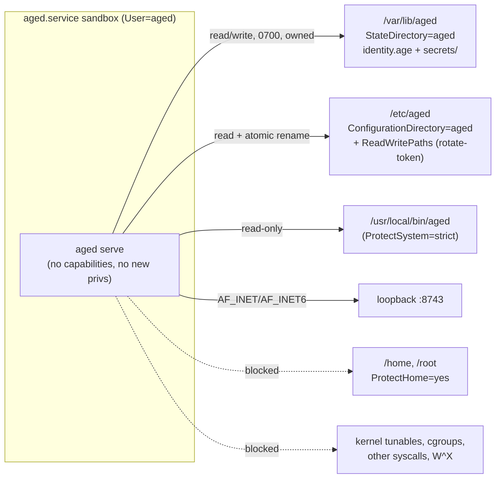

# Design: service-hardening

## Context

`aged.service` currently runs with `User=aged` and no other confinement (see the
existing unit: `Type=simple`, `ExecStart=/usr/local/bin/aged serve`, `Restart=on-failure`).
Audit finding **L-03 (2026-08-30)**: a post-compromise exploit inherits the full
`aged`-user filesystem and network reach — every path the `aged` user can read or
write, and every socket family it can open. `aged` is a single-purpose loopback
HTTP server, so almost none of that surface is needed at runtime. This change
applies the standard single-purpose-server systemd sandbox to shrink the blast
radius to "read the binary, read config, read/write its own secret store."

**The home-path conflict.** The sandbox's `ProtectHome=yes` makes `/home`, `/root`,
and `/run/user` inaccessible under the unit. But the current defaults and the README
server-setup steps point identity/secrets at `~/.config/aged/…` (home paths). Those
two are mutually exclusive: you cannot both hide home directories and store the
server's private key inside one. Resolving L-03 therefore forces a path-model
decision, and the resolution is to adopt `/var/lib/aged` as the canonical system
path — a location that lives outside `/home`, that `systemd` can create and own
automatically, and that survives `ProtectSystem=strict`.

## Decisions

### Writable state via `StateDirectory=aged` (not `ReadWritePaths=/var/lib/aged`)

`StateDirectory=aged` makes systemd **create** `/var/lib/aged` on service start if
absent, **own** it as `aged:aged`, set mode `0700`, and add it to the unit's
read-write set automatically. A bare `ReadWritePaths=/var/lib/aged` would only
poke a write hole in the sandbox — it would *not* create the directory or fix its
ownership/mode, leaving a manual `mkdir`/`chown` step that operators forget and
that drifts. `StateDirectory` is the declarative, self-healing mechanism and is the
idiomatic choice for a service's own persistent data; it also relocates cleanly if
`StateDirectory=` base is ever changed. Chosen for one-line correctness and no
manual provisioning.

### `ConfigurationDirectory=aged` for `/etc/aged`

Delegates creation, ownership, and permissions of `/etc/aged` to systemd rather
than a packaging/install step. Keeps config provisioning consistent with state
provisioning (both declarative in the unit) and guarantees the directory exists
before `ExecStart`.

### `ReadWritePaths=/etc/aged` is still required despite `ConfigurationDirectory`

`ConfigurationDirectory` creates `/etc/aged` but exposes it **read-only** to the
service (unlike `StateDirectory`, it is not added to the read-write set). That is
correct for config that is written at install time and only read at runtime — but
`aged rotate-token` rewrites `token` in `/etc/aged/config.toml` **at runtime**, and
it does so *atomically*: it `os.CreateTemp`s a new `.config-*.toml` in
`filepath.Dir(path)` (i.e. inside `/etc/aged`), then `os.Rename`s it over the
original (`rotate.go`). That requires **write access to the directory**, not just
the file — a temp-create + rename both touch `/etc/aged` itself. `ProtectSystem=strict`
plus the read-only `ConfigurationDirectory` would make both the create and the
rename fail with `EROFS`/`EPERM`. `ReadWritePaths=/etc/aged` re-opens exactly that
directory for writing while the rest of the filesystem stays read-only. Rationale:
the atomic-rotation guarantee is a settled behaviour of the store; the sandbox must
accommodate it rather than force a less-safe truncate-in-place.

### `ProtectSystem=strict` + `ProtectHome=yes`

`ProtectSystem=strict` mounts the entire filesystem read-only except the explicit
write holes above (`StateDirectory`, `ReadWritePaths`) and API mounts. `ProtectHome=yes`
makes `/home`, `/root`, `/run/user` inaccessible. Together they enforce the
`/var/lib/aged` path model: any lingering home-path config is not merely
discouraged, it is *unreadable* under the unit, so misconfiguration fails loudly at
start rather than silently reading a stray key. Operators must use `/var/lib/aged`
paths in `/etc/aged/config.toml`.

### `CapabilityBoundingSet=` (empty — drop all)

`aged` binds `127.0.0.1:8743`, a port above 1024, so it needs **no** capabilities —
not even `CAP_NET_BIND_SERVICE`. Emptying the bounding set removes every capability
from the process and its children permanently. Paired with `NoNewPrivileges=yes`
(from the proposal set) this closes privilege-escalation paths entirely.

### `RestrictAddressFamilies=AF_INET AF_INET6 AF_UNIX`

`AF_INET`/`AF_INET6` are required for the loopback listener. **`AF_UNIX` is included
because it is needed *today*, not for speculative future sockets**: journald logging
and NSS/resolver lookups performed by the Go runtime and glibc use `AF_UNIX`
sockets. Omitting it risks losing log output or breaking name resolution under the
sandbox. This three-family set is the minimal set that keeps logging and resolution
working; all other families (`AF_NETLINK`, `AF_PACKET`, etc.) are denied.

> Note (raised in review): the proposal justifies `AF_UNIX` as "potential future
> socket use." That rationale is weak and invites a reviewer to strip it under
> YAGNI. The real, present justification is journald/NSS — recorded here so the
> family is kept for the right reason.

### `SystemCallFilter=@system-service` with `SystemCallErrorNumber=EPERM`

`@system-service` is systemd's curated allow-list covering the syscalls a
well-behaved long-running service needs (file and socket I/O, memory, `getrandom`
for `crypto/rand`, threading). It denies the dangerous classes (`@raw-io`,
`@mount`, `@reboot`, `@swap`, kernel-module loading, etc.). `SystemCallErrorNumber=EPERM`
makes a blocked syscall **return `EPERM`** instead of killing the process with
`SIGSYS`. This is materially safer for a Go binary: the Go runtime and its scheduler
can observe and handle an `EPERM` from a stray syscall, whereas a `SIGSYS` is an
abrupt, hard-to-diagnose crash.

### `MemoryDenyWriteExecute=yes`

Forbids memory mappings that are simultaneously writable and executable (W^X),
blocking a large class of code-injection exploits. Safe for `aged` because Go
(since 1.14) executes only precompiled machine code and has **no JIT** — it never
needs to write-then-execute a page at runtime. Pure upside here.

### Migration: operators must move data from old home paths

`StateDirectory` provisions an **empty** `/var/lib/aged`; it does not migrate an
existing home-directory identity or secret store. Before restarting under the new
unit, operators must relocate the private key and secrets to `/var/lib/aged/` **and
re-own them** to `aged:aged` (files moved out of a user home retain that user's
ownership, which the `aged`-user service cannot read). This is a one-time,
operator-run step; see Operator Instructions. Getting the ownership wrong is the
most likely migration failure and is called out explicitly below.

## Operator Instructions

Run on the server after installing the new unit. Order matters — `/var/lib/aged`
does not exist until systemd creates it.

1. **Install the new unit and let systemd create the directories.** Copy the unit,
   `daemon-reload`, and start once so `StateDirectory`/`ConfigurationDirectory`
   create `/var/lib/aged` (`0700`, `aged:aged`) and `/etc/aged`.
2. **Stop the service** before touching its files: `sudo systemctl stop aged`.
3. **Migrate identity and secrets** from the old home path into `/var/lib/aged/`
   (`mv` `identity.age` and the `secrets/` tree), then **`sudo chown -R aged:aged
   /var/lib/aged`** — this is the step that is easy to miss and causes
   permission-denied reads if skipped.
4. **Update `/etc/aged/config.toml`** so `identity` and `secrets_dir` point at
   `/var/lib/aged/...` (no `~`/home paths — those are unreadable under `ProtectHome=yes`).
5. **Reload and restart:** `sudo systemctl daemon-reload && sudo systemctl restart aged`.
6. **Verify confinement:** `systemd-analyze security aged.service` — expect a
   substantially improved exposure score and green rows for the directives above.
   Confirm functional health with one `aged get` through the reverse proxy and one
   `aged rotate-token` followed by a restart (proves `ReadWritePaths=/etc/aged` and
   the atomic rewrite work under the sandbox).

## Out of Scope

- **No Go code changes.** The sandbox accommodates existing behaviour (loopback
  bind, `crypto/rand`, atomic `rotate-token`); nothing in `cmd/aged/` changes.
- **No new dependencies.**
- **No spec behaviour change** to the `aged` capability's runtime contract — this
  is a deployment/confinement change. (The engineer authors the delta spec for the
  hardening requirement; capability naming — a distinct `service-hardening`
  capability vs. a requirement under `aged` — is the engineer's call, flagged in
  review.)

## Component Breakdown

- **`aged.service` sandbox directives** — *Kind:* systemd unit (deployment artifact).
  *Done:* the unit carries the full proposal directive set with the decisions above;
  `systemd-analyze security aged.service` shows the hardened directives active and a
  materially reduced exposure score; the service starts, serves a `get`, and rotates
  a token under the sandbox.
- **`README.md` server-setup rewrite** — *Kind:* documentation. *Done:* setup uses
  `/var/lib/aged` for identity/secrets; the migration + `chown` step and the
  `ProtectHome=yes` note are present; no home-path examples remain in the server
  path. (The pre-existing `/etc/aged/env` step that the current unit never loads
  should be reconciled here — see review.)
