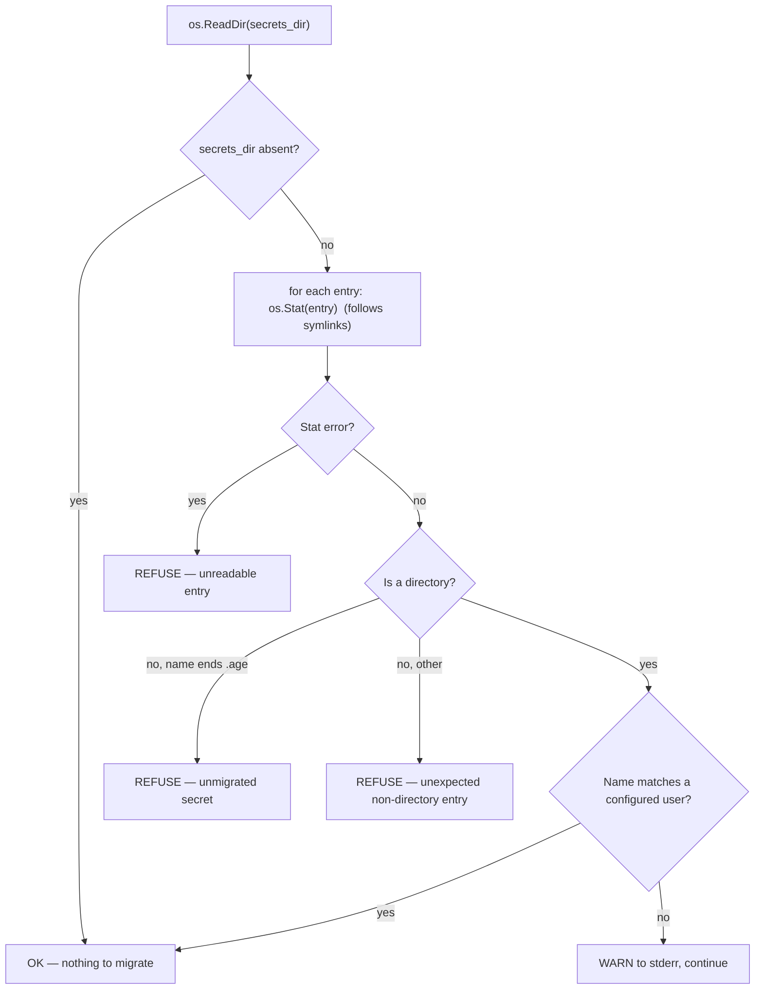
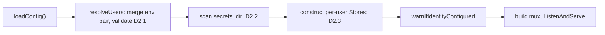

## Context

See `proposal.md` — Why. This document specifies **how**, and resolves every HIGH/MEDIUM finding from the architect and security review rounds that was not already folded into the proposal.

Constraints that shape the approach:

- `go.mod` declares `go 1.22`; the project depends only on `filippo.io/age v1.2.1` and `github.com/BurntSushi/toml v1.6.0`.
- `loadConfig()` is shared by the server *and* every client command. Server-only rules must not leak into it.
- `serve()` is a single function building one `http.ServeMux` from closures over one `*Store`. The design stays inside that shape.
- The `auth failure:` log line is a machine interface: `contrib/fail2ban/filter.d/aged-auth.conf` matches it with `failregex = auth failure: \S+ .+ from <HOST>(?::\d+)?$` — end-anchored.
- Deployment target is Linux on a case-sensitive filesystem (ext4).

### Verified external behaviour

Every claim below was verified against source or official documentation, not recalled. Decisions cite these by tag.

| Tag | Claim | Verified against |
|---|---|---|
| **V1** | `subtle.ConstantTimeCompare(x, y)` returns `0` **immediately** when `len(x) != len(y)`, before any byte comparison. Doc comment: *"If the lengths of x and y do not match it returns 0 immediately."* | `/usr/lib/go-1.22/src/crypto/subtle/constant_time.go` (Go 1.22.2) |
| **V2** | `subtle.ConstantTimeSelect(v, x, y)` is `^(v-1)&x \| (v-1)&y` — branch-free; returns `x` when `v==1`, `y` when `v==0`; behaviour undefined for other `v`. `ConstantTimeCompare` returns only `0` or `1`. | same file |
| **V3** | `os.Root` / `os.OpenRoot` **do not exist in Go 1.22**. They exist by Go 1.25.3. | Absent from `/usr/lib/go-1.22/src/os/`; present in pkg.go.dev `os@go1.25.3` |
| **V4** | BurntSushi/toml v1.6.0 parses a `[[users]]` array-of-tables into **`[]map[string]any`**. | `parse.go:581` `make([]map[string]any, 0, 4)`; `:586` append; `decode.go:287–291` → `unifyAnything` sets the raw parsed value verbatim into an `any` destination |
| **V5** | An *inline* array `users = [{name="a"}]` parses into **`[]any`** (elements `map[string]any`) — a different Go type from V4. | `parse.go:405` `array = make([]any, 0, 2)` |
| **V6** | `toml.Encoder` on a map sorts keys alphabetically and emits scalar keys before sub-table keys. Comments are not represented in `map[string]any` and are therefore discarded. | `encode.go:420` `sort.Slice(...)`; `:441–442` ordering |
| **V7** | `filepath.EvalSymlinks` exists in Go 1.22 and calls `Clean` on its result. `filepath.Rel` calls `Clean` on its result. | `/usr/lib/go-1.22/src/path/filepath/path.go:280–285`, `:309–317` |

## Goals / Non-Goals

**Goals:**

- A request authenticated with user X's token can only ever resolve a path under `secrets_dir/X/` — structurally, not by convention.
- Every misconfiguration that could produce cross-tenant access, an auth bypass, or a silent data outage is a **startup failure**, never a runtime 500 or a silent 404.
- Timing analysis of the auth path cannot reveal *which* user matched, or *whether* any matched.
- `rotate-token` and `rotate-identity` can never leave the system in a state that fails to start.

**Non-Goals (design level, beyond the proposal's):**

- OS-level (uid/gid) isolation between tenants — see Risks.
- Preserving config-file comments or key order across `rotate-token` (V6; see D5.4).
- Defeating an attacker who already executes code as the `aged` service user.

## Decisions

### D1 — Config schema and env-pair merge

**Schema.** `Config` gains one exported field and two unexported ones (unexported so BurntSushi/toml ignores them during decoding — the existing `identityExplicit` precedent):

```go
type UserConfig struct {
    Name  string `toml:"name"`
    Token string `toml:"token"`
}

// added to Config
Users       []UserConfig `toml:"users"`
envToken    string       // raw AGED_TOKEN, captured verbatim
envUsername string       // raw AGED_USERNAME, captured verbatim
```

`Config.Token` is **unchanged in meaning**: it remains the CLI client's own credential, read by `get`/`set`/`list`/`delete`. Only the server stops treating it as a tenant.

**Why capture `envToken` separately rather than reading `cfg.Token`.** By the time env overrides are applied, `cfg.Token` may have come from the config file's `token` key. Gating the env-constructed user on `cfg.Token != ""` would fabricate a tenant out of the *client's* credential whenever `AGED_USERNAME` happened to be set. The pair must be gated on both **environment variables** being present, so both are captured raw.

**Merge is not performed in `loadConfig`.** A new server-only resolver owns it:

```go
func resolveUsers(cfg Config) ([]UserConfig, []problem, error)
```

`loadConfig()` captures `envToken`/`envUsername` and does nothing else new. This keeps every client command unaffected — critical, because `AGED_TOKEN` alone is the *normal, correct* client configuration and must never be an error on the client path.

**Merge order (exact):**

1. Start with `cfg.Users` **in config-file order**.
2. If `envToken != "" && envUsername != ""` → **append** `UserConfig{envUsername, envToken}` as the last element.
3. Validate the whole resulting slice (D2).

Appending last, then validating, means an env user whose name collides with a file-defined one surfaces as a **duplicate-name error** naming both — it is neither silently overridden nor silently dropped. That is the review's stated requirement, satisfied by ordering alone rather than by a special case.

**Partial env pair is an error** (server path only):

| `AGED_USERNAME` | `AGED_TOKEN` | Server result |
|---|---|---|
| set | set | append one user |
| set | unset | **error** — `AGED_USERNAME is set but AGED_TOKEN is not; both are required to define a user from the environment` |
| unset | set | **error** — `AGED_TOKEN is set but AGED_USERNAME is not; set AGED_USERNAME to define a user from the environment, or unset AGED_TOKEN if it is only intended for client commands` |
| unset | unset | config-file users only |

*Rationale.* `AGED_USERNAME` has no meaning other than defining a user, so alone it is unambiguously a mistake. `AGED_TOKEN` alone is the exact shape of a **pre-upgrade single-user deployment** — the single most likely upgrade mistake. Silently ignoring it would start the server with the operator's token inert; if a `[[users]]` block also exists the server would come up *looking* healthy while the operator's credential authenticates nothing. Erroring converts that into a loud, pre-traffic failure with a message naming both remedies. The check lives only in the server's startup path, so no client is affected.

**Rejected:** appending the env user *first*, or letting it override a same-named file entry. Both make precedence invisible in the config file and hide operator mistakes.

### D2 — Startup validation

Validation is a pure function over the merged user slice returning a **list of problems**, each tagged with the offending user index and a category (`structural` or `tokenFormat`). One function, two consumers with different policies: `serve` treats every problem as fatal; `rotate-token` treats `tokenFormat` problems on *other* entries as warnings (D5.3). This avoids a mode flag and keeps a single authoritative ruleset.

#### D2.1 Rules

| # | Rule | Category | Addresses |
|---|---|---|---|
| 1 | At least one user after merge | structural | proposal; replaces `checkServeConfig`'s token check |
| 2 | Name matches `^[a-zA-Z0-9._-]+$` — **no `/`** | structural | review 3.4 |
| 3 | Name does not start with `-` | structural | review 3.4 |
| 4 | Name is not exactly `.` or `..` | structural | mirrors `validName` |
| 5 | Name length 1–63 bytes | structural | review 3.5 |
| 6 | Token is exactly 64 characters, every character in `[0-9a-f]` | tokenFormat | review 2.1, review 1 (security) |
| 7 | No two names equal after ASCII lowercasing | structural | review 3.2 (CWE-178) |
| 8 | No two tokens equal | structural | review 3.x |

**Rule 2 — why no `/`.** `validName` deliberately allows `/` as a namespace separator for *secret* names. A username is a single path segment: allowing `/` would let `name = "a/b"` create a nested tenant root whose directory tree overlaps another tenant's namespace. Usernames therefore get their own validator (`validUserName`) rather than reusing `validName`.

**Rule 3 — why reject a leading `-`.** A tenant directory name is passed to `aged rotate-identity --user <name>` and, far more often, to the operator's own shell (`tar`, `rm -r`, `rsync`) while managing the tree. A name like `-rf` is a live footgun in any of those contexts and has no legitimate use.

**Rule 5 — why 63 and not 255.** Linux `NAME_MAX` is 255 bytes per path component, which is the hard ceiling; 63 is a deliberately tighter, operator-sane bound. It leaves ample headroom for the suffixes the system itself appends to a tenant directory name — `rotate-identity` writes `<name>.old-20060102T150405Z` (20 extra bytes) and `<name>.rotating-XXXXXXXX` — so no generated sibling can approach `NAME_MAX` on any supported filesystem. 63 is also the familiar DNS-label bound, so operators already have intuition for it.

**Rule 6 — why a fixed hex format, and what it closes.** This single rule closes two separate findings:

- **(a) Empty-token auth bypass (review 2.1).** A `[[users]]` entry whose `token` key is missing or empty decodes to `""`. Without rule 6, an unauthenticated request whose `Authorization` header is absent yields `got == ""` after `TrimPrefix`, and `ConstantTimeCompare([]byte(""), []byte(""))` returns 1 — a complete auth bypass. Requiring a non-zero fixed length makes `""` structurally unrepresentable as a valid token.
- **(b) Length-based timing signal (review 1, security).** Per **V1**, `ConstantTimeCompare` short-circuits on unequal lengths *before* comparing any bytes. With variably-sized tokens, an attacker probing with candidates of different lengths could distinguish "this length matches some configured token" from "it matches none" by the presence or absence of the byte-comparison loop. Once *every* valid token is exactly 64 bytes, the short-circuit fires for all users or for none, identically — it can no longer carry per-user information.

*Why hex and not merely "64 characters".* This is not new strictness: the existing `Token Rotation` requirement already specifies *"a new cryptographically random 32-byte hex token"*, and `rotate.go` produces exactly `hex.EncodeToString(32 bytes)` = 64 lowercase hex characters. Rule 6 enforces the format the spec already defines. Enforcing the charset — not just the length — is what makes "all valid tokens share one length" a checked invariant rather than a coincidence, and it precisely catches truncation and whitespace-paste errors.

**Rule 7 — why fold, and how.** On a case-insensitive filesystem, `Alice` and `alice` map to a single directory: two distinct tokens would silently share one tenant's storage. The deployment target is case-sensitive, so this is defence-in-depth.

> **Recorded assumption:** `secrets_dir` MUST reside on a case-sensitive filesystem. The name-fold check reduces, but does not eliminate, the consequences of violating it.

Rules 2–5 run **before** rule 7 for every entry. Because rule 2 has already constrained names to ASCII, the fold is performed with `strings.ToLower`, which on pure ASCII is exact and locale-independent. This deliberately avoids `strings.EqualFold`'s Unicode case-folding and the Turkish-dotless-I class of bugs (CWE-178) — the input is constrained before it is folded, so no folding ambiguity can exist.

**Rule 8** compares tokens byte-exactly. The error names the two users and **never prints the token**.

#### D2.2 Unmigrated-store scan

Review 5.1 (architect) / review 5 (security, *"single highest-value recommendation"*). One level only, no recursion:



**Precise classification.** The structural rule is singular — *every entry directly under `secrets_dir` must be a directory* — and it subsumes the `.age` case. Two **message** variants exist because the operator's remedy differs completely:

- Non-directory ending in `.age` → the migration message: this file must be moved into `secrets_dir/<owner>/` before the server will start, naming the file and the configured user names.
- Any other non-directory (stray `README`, leftover `.tmp-*`, socket) → an unexpected-entry message: `secrets_dir` may contain only per-user directories.

**Classification uses `os.Stat`, not `DirEntry.IsDir()`.** `DirEntry` reports a symlink as a symlink, so a symlinked tenant root (`secrets_dir/alice -> /srv/alice`) would be rejected as a non-directory. `os.Stat` follows the link, making symlinked tenant roots permitted — consistent with D4, which canonicalises each tenant root through symlinks at startup. A **dangling** symlink fails `os.Stat` and is refused, which is correct: it is anomalous either way.

**An unknown *directory* warns; it does not refuse.** This is a deliberate choice against the stricter alternative, for two decisive reasons:

1. The proposal's accepted limitations state *"a removed user's directory is orphaned on disk indefinitely."* Refusing on unknown directories would convert every user removal into a startup failure — an all-tenant outage — directly contradicting that accepted behaviour.
2. `rotate-identity --user alice` leaves `secrets_dir/alice.old-<timestamp>/` as a **sibling inside `secrets_dir`** (D6.2). Refusing would mean a successful identity rotation bricks the next server start.

A warning still surfaces the genuinely dangerous case — a leftover single-tenant *namespace* directory such as `secrets_dir/ha/` containing `ha/token.age`, which is otherwise indistinguishable from a tenant directory and whose secrets would silently become unreachable.

**Aggregate, do not fail fast.** Collect every offending entry, sort by name, and report them in one error. An operator migrating thirty secrets needs one list, not thirty restart cycles. Cap the rendered list at 20 entries followed by `… and N more` so the error string stays bounded.

#### D2.3 Eager per-user `Store` construction

Review 3.6. Each user's `Store` is built at startup via `newStore(filepath.Join(secretsDir, name))`. Because `newStore` performs `os.MkdirAll(dir, 0o700)`, a name colliding with an existing **regular file**, or any permission failure, becomes a startup error naming the user and the path — never a runtime 500 on that tenant's first request. Stores are held in a slice parallel to the validated user slice for the life of the process.

#### D2.4 Startup order



Validation (pure, no I/O) precedes the filesystem scan, which precedes directory creation. Consequences, all intentional:

- An invalid config fails before any directory is created — no side effects from a rejected start.
- The scan runs *before* `MkdirAll`, so a brand-new user's not-yet-existing directory produces no "unknown directory" warning on first start.

**`checkServeConfig` is replaced, not extended.** Its `cfg.Token == ""` check must be **removed**: the server no longer requires `token`. It becomes the entry point that calls `resolveUsers` and returns the first fatal problem, preserving its existing role as the directly-testable guard (per its own doc comment).

#### D2.5 Error message convention

Match the existing codebase style — lowercase, no trailing period, no error wrapping of a bare string, actionable remedy where one exists (cf. `checkServeConfig`, `warnIfIdentityConfigured`, `refuseIfServerRunning`). Every message names the specific offending user and/or file. Examples of required shape (not literal strings to copy):

- `user "alice" has an invalid name: must match [a-zA-Z0-9._-] and must not start with "-"`
- `users "alice" and "bob" have the same token`
- `users "alice" and "Alice" differ only in case; names must be unique case-insensitively`
- `user "alice" has an invalid token: expected 64 hexadecimal characters, got 40 — run: aged rotate-token alice`
- `refusing to start: /var/lib/aged/secrets/ha-token.age is an unmigrated secret; move it into a user directory (configured users: alice, bob)`

### D3 — Auth resolution and tenant routing

#### D3.1 Constant-time multi-candidate resolution

Per **V1**, D2.1 rule 6 makes the length short-circuit uniform across all candidates. Per **V2**, `ConstantTimeSelect` provides branch-free index selection.

```go
// Illustrative shape only.
matched := 0
idx := -1
for i := range users {
    eq := subtle.ConstantTimeCompare([]byte(presented), []byte(users[i].Token)) // 0 or 1
    matched |= eq
    idx = subtle.ConstantTimeSelect(eq, i, idx)
}
// Single branch, AFTER the loop, on the aggregate only:
if matched != 1 { /* 401 */ }
t := tenants[idx]
```

Mandatory properties:

- **No `break`, no `return`, no `continue` inside the loop.** Every configured user is compared on every request, whether or not an earlier one matched.
- The loop body performs **no data-dependent branching**: `|=` and `ConstantTimeSelect` are pure bit operations (V2).
- `ConstantTimeSelect`'s contract requires `v ∈ {0,1}`; `ConstantTimeCompare` returns exactly `0` or `1` (V1), so the contract holds by construction.
- D2.1 rule 8 (no duplicate tokens) guarantees at most one match, so `idx` is unambiguous.
- The single post-loop branch reveals only the authentication outcome itself, which is the response the caller receives anyway.
- Indexing `tenants[idx]` occurs only *after* a successful match. The selected value identifies the already-authenticated caller to itself; it is not attacker-reachable information.

**The claim, stated precisely.** Timing analysis cannot distinguish *which* configured user's token matched, nor *whether* any matched. It does **not** conceal *how many* users are configured — total loop cost scales with N. That is accepted and correct: the user count is operator-visible configuration, not a secret (review 2.2 architect / review 1 security). Likewise, a presented token of the wrong length makes every comparison short-circuit (V1), which is cheaper overall — but the presented length was chosen by the attacker, so this reveals nothing they did not already know.

**Testing.** Assert this **structurally**, not by wall-clock measurement: a test that drives the resolver with an instrumented comparison counter and asserts every configured user was compared exactly once regardless of match position. Wall-clock timing tests are flaky and prove nothing on a shared CI runner.

#### D3.2 Tenant routing

The middleware changes the *shape* of the handler it wraps rather than smuggling the tenant through request context:

```go
type tenant struct {
    name  string
    store *Store
}
type tenantHandler func(http.ResponseWriter, *http.Request, *tenant)

func bearerMiddleware(tenants []tenant, logDst io.Writer) func(tenantHandler) http.HandlerFunc
```

Handler bodies change mechanically: `store.listNames()` → `t.store.listNames()`, and so on for all four endpoints. `serve()` keeps its single-mux-of-closures structure; only the closure signature and one receiver change.

**Rejected: `context.WithValue`.** It requires an unexported key type plus a getter that can fail, forcing every handler to carry an untestable "no tenant in context" branch that either panics or 500s. The explicit-parameter form makes it **statically impossible** to write a handler that runs without a resolved tenant — the stronger guarantee, at a smaller diff.

#### D3.3 Log format

**Failure line: completely unchanged.** `contrib/fail2ban/filter.d/aged-auth.conf` uses an end-anchored `failregex = auth failure: \S+ .+ from <HOST>(?::\d+)?$`. Any appended field would break the match. There is also no resolved user on failure — attaching the attempted token or a guessed name would be a disclosure, not a feature.

**Success line: append only.**

| | Format |
|---|---|
| Before | `auth ok: %s %s from %s` |
| After | `auth ok: %s %s from %s as %s` |

Appending (rather than inserting the username after the `auth ok:` prefix) means any existing consumer anchored on the current prefix and field order continues to match. The fail2ban filter matches only `auth failure:` lines, so it is unaffected either way.

> **This is a breaking change to a documented machine interface** and must be called out in the spec and in `README.md`, which currently documents the old success line verbatim (README §log format). The `Secret Listing` behavioural change and this line are the two client/operator-visible format changes in the release.

The username is passed through `sanitiseLogField` like the other three fields. Given D2.1 rules 2–5 this is provably a no-op — no control character can survive name validation — but applying it uniformly means no future reviewer has to re-derive that proof from two files, and it costs one function call per authorised request.

### D4 — Path containment hardening

#### D4.1 The two defects, stated separately

Review 1.1 conflated a correctness bug and a security gap. They need different fixes.

**(a) The containment predicate is the weak form.** The current test is `strings.HasPrefix(rel, "..")`. Because `nameRe` allows `.` inside a segment, `..foo` is a **valid secret name** that passes `validName` (its segments are not exactly `.` or `..`), yet `filepath.Rel(root, root+"/..foo")` returns `"..foo"`, which the weak prefix test rejects. This is an over-rejection of a legitimate name — fail-safe, but wrong. Replace with the precise idiom:

```go
rel == ".." || strings.HasPrefix(rel, ".."+string(filepath.Separator))
```

**(b) The check is purely lexical.** `filepath.Rel` is a string operation (V7); it never touches the filesystem. A symlink at `secrets_dir/alice/link -> ../bob` produces a path that is lexically inside `alice` and physically inside `bob`. Under the old single-tenant model this was harmless — there was one tenant. Now that directory isolation **is** the security boundary, it is a cross-tenant read/write/delete.

#### D4.2 Chosen fix: canonicalised root + per-operation symlink resolution

**Root canonicalisation (once, at startup).** `newStore` stores, alongside `secretsDir`, a `canonicalDir` obtained by `filepath.EvalSymlinks` on the created directory (V7). This resolves a symlinked tenant root exactly once, so a legitimate `secrets_dir/alice -> /srv/alice` deployment keeps working and everything beneath is measured against `/srv/alice`.

**Per-operation resolution — two distinct cases.** `EvalSymlinks` fails if any component does not exist, which forces the split:

| Caller | Target state | Resolve | Re-verify |
|---|---|---|---|
| `getValue`, `removeValue` | file must already exist | `EvalSymlinks(path)` | resolved path is inside `canonicalDir` |
| `setValue` | file may not exist yet | `EvalSymlinks(filepath.Dir(path))` after `MkdirAll` | resolved **parent** is inside `canonicalDir`, then append the final `<name>.age` element |

For `setValue` the final element is the file the store is about to create; it is never a pre-existing symlink target the store follows, because `writeFileAtomic` stages to a fresh `os.CreateTemp` file and `os.Rename`s over the destination — `Rename` does not traverse a symlink at the destination path, it replaces it. Resolving the parent is therefore sufficient and correct.

A resolution error that is **not** `fs.ErrNotExist` (e.g. a symlink loop, `ELOOP`) is an error, not a fallback to the lexical check. `fs.ErrNotExist` on `getValue`/`removeValue` maps to the existing 404 path unchanged.

Both the lexical precise-form check (D4.1a) and the resolved-path check run — the lexical one rejects a malformed name cheaply before any syscall, the resolved one is the security boundary.

**Alternatives considered:**

- **`os.Root` (directory-confined I/O).** Strictly stronger: on Linux it is kernel-enforced via `openat2`/`RESOLVE_BENEATH`, eliminating the TOCTOU window entirely. **Rejected for now** because it does not exist in Go 1.22 (**V3**), so adopting it means bumping the `go` directive by several minor versions *and* rewriting `Store`'s I/O — including `writeFileAtomic`'s `CreateTemp`+`Rename` pattern — onto `Root` methods whose availability varies by version (`Root.Rename`, `Root.RemoveAll`, and `Root.WriteFile` are present by 1.25.3 but were not all in the initial `Root` API). That is a disproportionate blast radius for this change. **Recorded as the preferred future fix** the next time the project's minimum Go version moves; the engineer should confirm the exact introducing release before acting on it, since only the 1.22-absence and 1.25.3-presence bounds are verified here.
- **Reject all symlinks unconditionally** (`Lstat` every component). Simpler to reason about — aged itself never creates symlinks — but it would forbid the legitimate symlinked tenant root that D2.2's `os.Stat` classification deliberately permits. Rejected for that inconsistency.

**Accepted residual risk (TOCTOU).** A symlink swapped between `EvalSymlinks` and the subsequent `open` defeats this check. Winning that race requires the ability to create files inside `secrets_dir`, i.e. code execution as the `aged` service user — an actor who can already read every tenant's ciphertext directly. The residual risk therefore falls entirely inside the already-accepted "application-layer isolation only, no OS-level backstop" limitation and adds nothing new to the trust model.

#### D4.3 `removeValue` cleanup-loop root normalisation

Review 1.3. The loop terminates on `dir != s.secretsDir`. `filepath.Dir` returns a cleaned path with no trailing separator, so a `secrets_dir` carrying a trailing slash — the form `README.md` §config documents as the default, `~/.config/aged/secrets/`, and which `spec.md`'s env-var table repeats — **never compares equal**, and the loop climbs above the intended root, deleting the secrets directory itself once it empties.

**Fix at the source, not at the loop.** `newStore` applies `filepath.Clean` to `secretsDir` before storing it. This corrects the guard by construction for every caller — including `rotate-identity`, which constructs its own `Store` — rather than patching one comparison. `listNames`'s `WalkDir`/`Rel` and `secretPath`'s `Join` are all unaffected by a cleaned root.

Note that under the multi-tenant layout `filepath.Join(cfg.SecretsDir, username)` already cleans the result, so tenant stores would *incidentally* be safe. Normalising in `newStore` is still the right fix: it holds regardless of how a caller constructs the path, and it makes the loop's correctness a local, readable property.

### D5 — `rotate-token` redesign

#### D5.1 Defensive decoding of `[[users]]`

`rotateToken` keeps decoding into `map[string]any` so unknown keys survive. Per **V4**, `raw["users"]` is `[]map[string]any` for a genuine `[[users]]` block. Per **V5**, an inline `users = [{…}]` array yields `[]any` — a *different* Go type. A bare `raw["users"].([]map[string]any)` therefore panics on a plausible operator variation (review 4.1). **No bare type assertions anywhere in this path.**

Required chain, every step producing a clean error and never a panic:

1. `v, ok := raw["users"]` — absent → error: the config defines no `[[users]]`, with the remedy.
2. Type switch on `v`:
   - `[]map[string]any` → use directly (V4).
   - `[]any` → convert element-wise; an element that is not `map[string]any` errors naming its **index** and actual type (V5).
   - default → error naming the actual type: `config key "users" is %T, expected an array of [[users]] tables`.
3. Empty slice → error.
4. Per entry: `e["name"]` absent → error naming the index; present but not `string` → error naming the index and actual type. Same shape for `token` when it is read.

#### D5.2 Target selection and CLI behaviour

Reviews 4.4, 4.6:

| Configured users | `<username>` argument | Behaviour |
|---|---|---|
| exactly 1 | omitted | auto-select; **always print** the selected name, even though it is unambiguous |
| exactly 1 | given, matches | rotate it |
| exactly 1 | given, no match | error, listing configured names |
| more than 1 | omitted | error: username required, listing configured names |
| more than 1 | given | rotate it, or error listing configured names |

The selected username is printed **unconditionally**, including the single-user case, so the operator's terminal record is unambiguous and scripts do not have to infer it.

"Unknown username" errors **always list the configured names**, sorted. This is not a new disclosure: invoking `rotate-token` requires read access to the config file, which already contains every name and every token.

**Pre-mutation checks** are limited to what is needed to identify the target unambiguously: names present, of type `string`, and unique after ASCII lowercasing. Token format is deliberately **not** checked before mutation — see D5.3.

#### D5.3 Post-mutation validation policy

Review 4.3: a rotation must never produce an unstartable config. After generating the new token and setting it on the target entry, run the **full D2.1 ruleset** over the resulting user set, in memory, before writing anything. Any problem aborts, leaving the original file untouched.

One deliberate exception prevents a deadlock. If `tokenFormat` problems were fatal for *every* entry, then a config in which user A holds a malformed token could never be repaired: rotating B would abort on A, and rotating A would abort on… A is fixed by that very run, but a second malformed user C would still block it. Since `rotate-token` is precisely the remediation path for a malformed token, it must not be blocked by a *different* user's malformed token. Policy:

- `structural` problems anywhere → **fatal**, abort.
- `tokenFormat` problem on **any other** entry → **warning** to stdout naming the user and the remedy (`aged rotate-token <name>`), then proceed.
- `tokenFormat` problem on the **rotated** entry → impossible by construction (the value was just generated as 64 hex characters); if it somehow occurs it is fatal, as it indicates a bug.
- **Duplicate tokens (rule 8) remain fatal always**, even though duplication is token-related: it is a security property, not a format nicety, and the new random token cannot collide except through a bug.

Repeated invocations therefore converge monotonically on a fully valid config, and the operator is told exactly which users remain.

#### D5.4 Writing

The existing write path is preserved **verbatim**: `os.CreateTemp` in the config file's own directory, fd-based `Chmod(0o600)`, `toml.NewEncoder(tmp).Encode(raw)`, `Close`, then the ownership-preservation step (`os.Stat` → `fileOwnerFunc` → `chownFunc`, with the existing warning when the owner is undeterminable), then `os.Rename`. Review 4.5: **this ownership-preservation logic, the `defer os.Remove`, and the failure-leaves-original-intact guarantee survive this change unchanged.** Nothing about the atomic-write or ownership behaviour is modified — only the in-memory mutation between decode and encode.

#### D5.5 Accepted limitation: comments and key order

Per **V6**, the encoder serialises from `map[string]any`. Comments are not represented in that map and are discarded; keys are re-emitted **sorted alphabetically**, with scalar keys before table and array-of-table keys. The output is therefore deterministic but not byte-identical in layout to the operator's original file.

> **Accepted limitation.** Per-user identifying comments (e.g. `# laptop`, `# ci-runner`) are lost on every `rotate-token` run, and key order is normalised to alphabetical. This is **not new** — today's `rotate-token` already round-trips the whole file through `map[string]any` and has always had this behaviour. `[[users]]` merely makes it more noticeable, because per-user comments are the natural way to annotate which machine a token belongs to. Building a comment-preserving TOML encoder is disproportionate to this change; instead, the README will recommend encoding that information in the **username itself** (`name = "laptop"`, `name = "ci-runner"`), which survives every rotation and is additionally surfaced in the new `auth ok: … as <user>` log line.

### D6 — `rotate-identity` scoping

#### D6.1 The `--user` flag

| Configured users | `--user` | Behaviour |
|---|---|---|
| exactly 1 | omitted | default to the sole user; print the selected name |
| exactly 1 | given | must match, else error listing names |
| more than 1 | omitted | **refuse**, naming the required flag and listing configured users |
| more than 1 | given | must match, else error listing names |

Refusing when ambiguous is essential: without it, `rotateIdentity` would resolve `cfg.SecretsDir` — the shared multi-tenant *base* — and attempt to re-encrypt every tenant's secrets to one identity, then atomically swap the whole base directory. That is a fleet-wide, cross-tenant data event triggered by an omitted flag.

`parseRotateIdentityArgs` gains `--user <name>` alongside the existing `--dry-run`, in any order. It must handle `--user` appearing as the final argument with no value (error) and must not silently treat the next flag as the value.

#### D6.2 Effective-root substitution — confirmed clean, with two consequences

Today `rotateIdentity` calls `newStore(cfg.SecretsDir)` and passes `cfg.SecretsDir` to `performRotate`. The change is to compute `effectiveRoot := filepath.Join(cfg.SecretsDir, username)` once and use it in **both** places. Reading the current pipeline confirms this is a clean parameter substitution, not a hand-wave:

- `store.listNames()` walks from the store root and returns names **relative** to it. Under `secrets_dir/alice`, it yields plain secret names with no `alice/` prefix — so `migrateOneSecret`'s `validName(name)` gate, the name-binding envelope, and `unpackEnvelope` all see exactly the names they see today. **No change needed.**
- `refuseIfServerRunning(cfg.Addr)` is unchanged and remains correct: there is one server process for all tenants.

Two naming schemes do change what they produce, and both are acceptable — but only because of choices made elsewhere in this design:

1. **Backup:** `backupDir := secretsDir + ".old-" + timestamp` becomes `secrets_dir/alice.old-20060102T150405Z` — a **sibling of `alice`, inside `secrets_dir`**, not outside it.
2. **Staging:** `os.MkdirTemp(filepath.Dir(secretsDir), filepath.Base(secretsDir)+".rotating-*")` becomes `secrets_dir/alice.rotating-XXXXXXXX` — also inside `secrets_dir`, and transient (removed by the existing `defer os.RemoveAll`).

**Keep both schemes as they are.** The critical invariant is that staging, backup, and live directory share one parent so that both `os.Rename` calls in the swap are same-filesystem and therefore atomic. Substituting the effective root preserves that invariant exactly — the shared parent simply becomes `secrets_dir` instead of its parent. Relocating backups outside `secrets_dir` to keep the base "clean" would weaken the same-filesystem guarantee and would change the single-user backup location that `spec.md` and `README.md` already document.

The consequence is that `secrets_dir` will contain `alice.old-*` directories after a rotation. These are precisely why **D2.2 warns rather than refuses** on unknown directories: the stricter alternative would have made a successful `rotate-identity` prevent the next server start. They surface as a one-line startup warning, which is the correct outcome — the command's own output already instructs the operator to delete the backup once the new identity is verified.

Note also that `alice.old-20060102T150405Z` is itself a *syntactically valid* username under D2.1. This is harmless — no token maps to it, so it is unreachable over HTTP — but the startup warning naming it is worth having so the operator notices leftovers.

Finally, with `--user`, the command touches **only** that tenant's subtree; any unmigrated loose `.age` files directly under `secrets_dir` are simply ignored. No extra check is added for this: the server's own startup scan (D2.2) already refuses to run in that state, which is the enforcement point.

## Risks / Trade-offs

### Trust model (explicit)

The following statements are **accepted, documented limitations** of this design, in the same style as the archived `client-side-encryption` change's accepted limitations. They belong in `README.md` as well as here.

**Isolation is application-layer only.** Every tenant's directory is owned by the single user that runs `aged serve`, with mode `0700` against *other* OS users but no distinction *between* tenants. There is no uid/gid or `chmod` backstop: if the server process is compromised, or a bug defeats the path-containment check (D4), nothing at the OS level prevents cross-tenant access. The guarantee this change provides is "the server never resolves a path outside the authenticated caller's root", not "the OS forbids it".

**Confidentiality from the operator is unchanged — this change adds nothing to it.** That property is provided entirely by client-side encryption: the server stores opaque ciphertext and holds no identity. Multi-user support does not strengthen it and does not weaken it. An operator with filesystem access could always read, move, or delete any tenant's ciphertext files, and still can; they simply cannot decrypt them.

**Adding or revoking a user requires a full service restart.** The user list is read once at startup and never reloaded. Revoking a compromised token therefore causes an outage for **every** tenant, not just the one being revoked. → *Mitigation:* the restart is brief and the operation is rare; hot-reload is an explicit non-goal. Operators should expect an all-tenant blip whenever any tenant's membership changes.

**A removed user's directory is orphaned indefinitely.** Removing a `[[users]]` entry makes that tenant's ciphertext unreachable over HTTP but leaves it on disk, consuming space, appearing in backups, and producing a startup warning (D2.2). → *Mitigation:* the warning names it; deletion is a deliberate operator action (`rm -r`), never automatic — automatic deletion of a tenant's only copy of its secrets, triggered by a config edit, would be far more dangerous than the orphan.

**No per-user quotas or rate limits.** The 96 KiB upload limit and the underlying disk are shared. Any authenticated tenant can exhaust disk for all tenants, and can issue unlimited requests. → *Mitigation:* none in this change; tenants are assumed semi-trusted (each already holds a valid token issued by the operator). fail2ban covers unauthenticated abuse only.

**The name-binding envelope does not bind tenant identity.** The envelope binds a secret to its *name* (`aged-v1\nname: <name>\n\n`), not to its owner. A secret misfiled into the wrong tenant's directory under the *same* name is therefore **not** detected by the envelope — it is caught only when that tenant holds a different age identity than the correct owner, in which case decryption simply fails. → *Mitigation:* the README must recommend a **distinct identity per tenant**. Two tenants sharing one identity lose this incidental detection entirely, and a misfiled secret would be returned to the wrong tenant with no error at any layer.

**The timing-safety claim is scoped to "which/whether", not "how many".** See D3.1. The number of configured users is operator-visible configuration and is not treated as a secret.

### Other risks

| Risk | Mitigation |
|---|---|
| Operator upgrades, forgets to migrate loose secrets → fleet-wide silent 404 outage | D2.2 refuses to start and names every offending file. This is the highest-value check in the change. |
| Operator upgrades with only `AGED_TOKEN` set → server starts with an inert credential | D1 makes the partial env pair a startup error with both remedies named. |
| `rotate-token` run against a config with a duplicate name → ambiguous target | D5.2 checks name uniqueness before mutating. |
| `rotate-identity` run without `--user` on a multi-tenant box → cross-tenant re-encryption of the whole base | D6.1 refuses. |
| Per-user comments lost on rotation → operator can no longer tell which token is which machine | D5.5: encode the identity in the username; it survives rotation and appears in the `auth ok:` line. |
| TOCTOU between `EvalSymlinks` and `open` | D4.2: requires code execution as the service user, who can already read all ciphertext. Inside the accepted application-layer-only limitation. `os.Root` is the recorded future fix. |
| Success-log format change breaks an unknown consumer | Appended, not inserted, so prefix/field-order-anchored matchers still work; fail2ban matches only the failure line. Called out as breaking in spec and README. |

## Migration Plan

Per-deployment, in order. Step 3 is the one that is **not** a single `mv`, because namespaced secrets already create legitimate subdirectories directly under `secrets_dir`.

1. **Stop the service.** `systemctl stop aged`.
2. **Choose the username** that will own the existing store (e.g. `laptop`).
3. **Move the existing store into a named subdirectory.** Because `secrets_dir` already legitimately contains *namespace* subdirectories (`ha/`, `infra/`) alongside top-level `.age` files, the safe sequence is: create a sibling staging directory, move **every** existing entry into it, then move it into place as the tenant directory:
   ```
   mkdir -m 700 "$SECRETS_DIR/../laptop.staging"
   mv "$SECRETS_DIR"/* "$SECRETS_DIR/../laptop.staging"/      # both .age files and namespace dirs
   mv "$SECRETS_DIR/../laptop.staging" "$SECRETS_DIR/laptop"
   ```
   Using a sibling staging directory avoids `mv secrets/* secrets/laptop/` attempting to move `laptop` into itself. Verify ownership and modes afterwards (`0700` directories, `0600` files, owned by the service user).
4. **Rewrite the config** to a `[[users]]` block (or set the `AGED_TOKEN` + `AGED_USERNAME` pair). Keep the existing token value to avoid re-provisioning clients in the same step.
5. **Start the service.** If step 3 was incomplete, startup **fails loudly** and names the files still to be moved (D2.2). Fix and retry — no traffic is served in a broken state.
6. **Verify** with `aged list` from a client: it must return exactly that tenant's names.
7. **Add further users** by appending `[[users]]` entries and restarting (all-tenant blip; see Risks).

**Rollback.** Stop the service, restore the previous binary, restore the previous config (top-level `token`), and move the tenant directory's contents back up one level (inverse of step 3). Nothing in this change is destructive to ciphertext: no file content is rewritten, only relocated, and no crypto or identity is involved.

## Component Breakdown

| Component | Work kind | Done when |
|---|---|---|
| `Config.Users`, `UserConfig`, `envToken`/`envUsername` capture | Go — config | `loadConfig` populates all four; no client command's behaviour changes; existing config tests pass unmodified |
| `resolveUsers` + `validUserName` + problem list (D1, D2.1) | Go — validation | Table-driven tests cover every rule in D2.1 and every row of D1's env-pair matrix, including both partial-pair errors |
| Unmigrated-store scan (D2.2) | Go — server startup | Refuses on a loose `.age`, on a non-directory entry, and on a dangling symlink; warns (does not refuse) on an unknown directory; aggregates and caps the offender list |
| `checkServeConfig` replacement + startup ordering (D2.3, D2.4) | Go — server startup | The `cfg.Token == ""` check is gone; a name colliding with a regular file is a startup error, not a runtime 500; ordering matches D2.4 |
| Multi-candidate auth resolver (D3.1) | Go — security-critical | A structural test asserts every configured user is compared exactly once regardless of which one matches; no early exit exists in the loop |
| `tenantHandler` routing + handler rewiring (D3.2) | Go — server | All four endpoints operate on the resolved tenant's store; `GET /secrets` returns only that tenant's names |
| Success-log format (D3.3) | Go — server | Success line carries the username as a trailing field; the failure line is byte-identical to today; the shipped fail2ban filter still matches |
| `secretPath` precise + symlink-resolved containment (D4.1, D4.2) | Go — security-critical | `..foo` is accepted as a valid name; a symlink from one tenant's tree into another's is rejected on get, set, and delete |
| `newStore` root `Clean` (D4.3) | Go — store | A `secrets_dir` with a trailing slash no longer lets the delete cleanup loop climb above the root |
| `rotateToken` array-of-tables handling (D5.1–D5.4) | Go — CLI | No input shape panics: `[]map[string]any`, `[]any`, a scalar, a missing key, and a non-string `name` each produce a clean error; ownership preservation and atomicity tests pass unchanged |
| `rotateIdentity --user` (D6) | Go — CLI | Refuses without `--user` when >1 user; operates only on that tenant's subtree; backup and staging land as siblings inside `secrets_dir` |
| CLI arg wiring + help text | Go — CLI | `rotate-token [<username>]` and `rotate-identity <file> [--user <name>] [--dry-run]`; help lists `AGED_USERNAME` |
| README updates | Documentation | `[[users]]` config example; `AGED_USERNAME` row; new success-log format; per-tenant-identity recommendation; the step-3 migration sequence |

## Spec Requirement Mapping

Proposed mapping to `openspec/specs/aged/spec.md`. The engineer authors the delta specs and owns final naming.

| Decision | Spec impact |
|---|---|
| D1 — config schema, env pair | **MODIFIED** `Environment Variable Configuration` — add the `AGED_USERNAME` row; state that `token`/`AGED_TOKEN` is the *client* credential and no longer authenticates server requests; replace the "Missing token on startup" scenario with a "no users configured" scenario; add both partial-env-pair scenarios. **ADDED** `Multi-User Configuration` — the `[[users]]` schema and the exact merge order (file entries in order, then the env-constructed entry appended last). |
| D2.1 — validation ruleset | **ADDED** `Multi-User Configuration` — all eight rules as scenarios, including the fixed 64-hex token format and the case-insensitive name-uniqueness rule with its recorded case-sensitive-filesystem assumption. |
| D2.2 — unmigrated-store scan | **ADDED** `Per-User Storage Isolation` — refuse on any non-directory entry directly under `secrets_dir` (distinct message for `.age`); warn on an unknown directory; aggregate offenders. |
| D2.3 — eager `Store` construction | **ADDED** `Per-User Storage Isolation` — a per-user store failure is a startup error, not a runtime error. |
| D2.4 — startup ordering | *No spec requirement* — internal sequencing, observable only through the already-specified failure behaviours in D2.1/D2.2. |
| D2.5 — error message convention | *No spec requirement* — a codebase convention, not a behavioural contract; exact strings are deliberately unpinned. |
| D3.1 — multi-candidate constant-time auth | **MODIFIED** `HTTP Authentication` — compare against every configured user with no early exit; state the scoped timing claim ("which/whether", not "how many"). |
| D3.2 — tenant routing | **MODIFIED** `Secret Listing` — `GET /secrets` returns only the authenticated caller's names. **MODIFIED** `Secret Storage` — *(lower confidence; engineer to confirm)* the wording "in the configured secrets directory" now means the authenticated user's directory; `Secret Retrieval` and `Secret Deletion` may need the same wording change, or may be adequately covered by reference from `Per-User Storage Isolation`. |
| D3.3 — success-log format | **MODIFIED** `HTTP Authentication` — the pinned success format becomes `auth ok: <METHOD> <PATH> from <IP> as <USER>`; the failure format is explicitly unchanged. Flag as breaking. |
| D4.1/D4.2 — containment hardening | **MODIFIED** `Namespaced Secret Names` — the resolved path SHALL be verified against a symlink-resolved tenant root, using the precise `rel == ".." \|\| HasPrefix(rel, ".."+sep)` form; a symlink escaping the tenant root SHALL be rejected on get, set, and delete. |
| D4.3 — cleanup-loop root | **MODIFIED** `Namespaced Secret Names` — the "Delete removes empty namespace directories" scenario gains the guarantee that the store root itself is never removed, including when `secrets_dir` carries a trailing separator. |
| D5.1–D5.4 — `rotate-token` | **MODIFIED** `Token Rotation` — optional username argument (required when >1 user, auto-selected and always printed when exactly 1); unknown username lists configured names; malformed `users` structures error rather than panic; the full ruleset is validated before writing; atomicity and ownership preservation are explicitly retained. |
| D5.5 — comment/order loss | **MODIFIED** `Token Rotation` — the existing "all other config file fields are unchanged" wording is imprecise and must be narrowed: field *values* are preserved, but comments are discarded and key order is normalised to alphabetical. This documents pre-existing behaviour more accurately rather than introducing it. |
| D6 — `rotate-identity --user` | **MODIFIED** `Identity Rotation` — `--user <name>` required when >1 user configured; the command operates on `secrets_dir/<name>`; the backup is a timestamped sibling *inside* `secrets_dir`. |
| D7 — trust model | *No spec requirement* — accepted limitations are documentation (this section plus `README.md`), not testable system behaviour. The one exception is the distinct-identity-per-tenant recommendation, which is guidance, not a constraint the system can enforce. |
